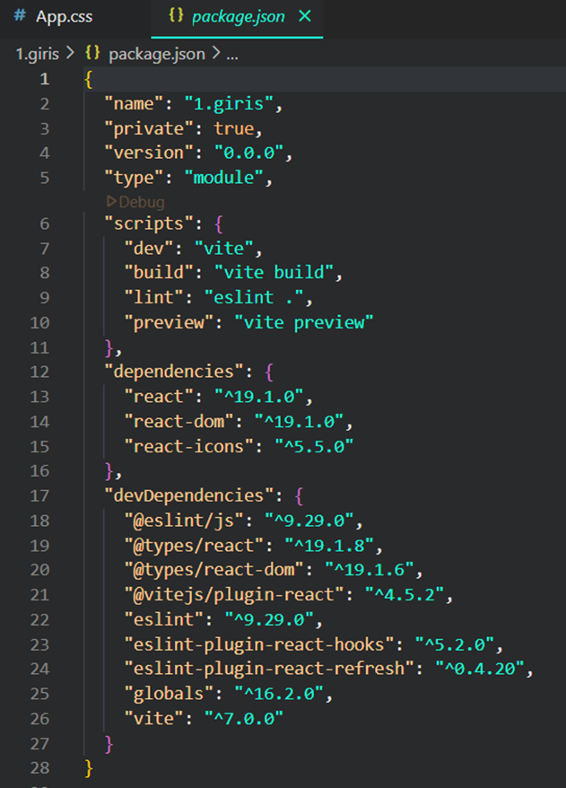
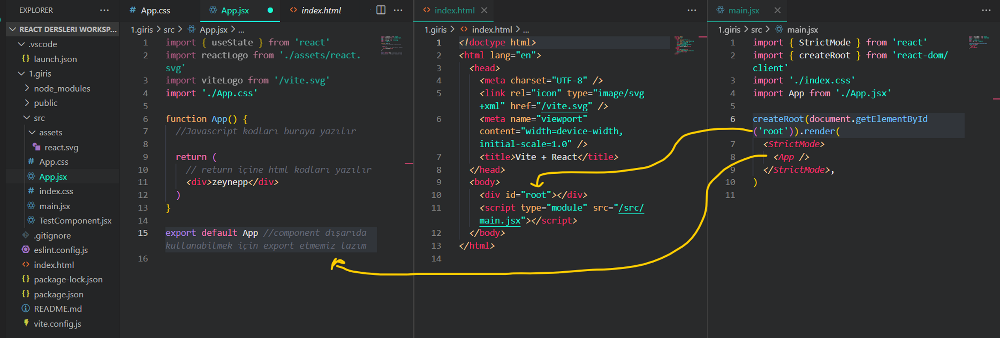

# React Projesi Yapısı – Açıklamalı ve Görselli

Bu döküman, Vite ile oluşturulmuş bir React projesinin dosya yapısını, `App.jsx`, `main.jsx`, `index.html` gibi dosyaların görevlerini ve aralarındaki ilişkiyi açıklamaktadır.

---

## 📦 `package.json` Nedir?

React projesinin tüm bağımlılıklarının, komutlarının ve meta bilgilerin tutulduğu ana yapılandırma dosyasıdır.

### Örnek `package.json` içeriği:
![package.json içeriği]

- `name`, `version`, `private`: Projenin adı ve ayarları
- `scripts`: `npm run dev`, `npm run build` gibi komutlar burada tanımlanır
- `dependencies`: React, ReactDOM ve diğer modüller
- `devDependencies`: Geliştirme sırasında kullanılan paketler (ESLint, pluginler vs.)

---

## 🔗 Dosya Yapısı ve Bileşenler Arası İlişki

Aşağıdaki görselde proje dosya yapısı ve `App.jsx`, `index.html`, `main.jsx` ilişkisi açıklanmıştır:

![Proje iç yapısı ve bağlantılar]

### Açıklamalar:

#### `index.html`
- HTML’in giriş noktasıdır.
- `<div id="root"></div>` kısmı, React uygulamasının gömüldüğü alandır.
- `<script type="module" src="/src/main.jsx">`: React uygulamasını başlatır.

#### `main.jsx`
```jsx
createRoot(document.getElementById('root')).render(
  <StrictMode>
    <App />
  </StrictMode>
)
```
- `App` bileşenini HTML'deki `root` elementine render eder.

#### `App.jsx`
```jsx
function App() {
  return (
    <div>zeynep</div>
  )
}
```
- React uygulamasının ana bileşenidir. Burada tüm alt bileşenler yönetilir.

> **Not:** `App.jsx` dışarıda kullanılabilmesi için `export default App` ile dışa aktarılmıştır.

---

## 🧠 Genel Akış

1. `index.html` içinde `div#root` bulunur
2. `main.jsx`, `App.jsx` bileşenini alır ve `root` içine render eder
3. `App.jsx`, sayfanın görünen kısmını oluşturur
4. Tüm React bileşenleri buradan türetilir ve yayılır

---

Bu yapı, modern React projelerinin temel iskeletini oluşturur ve öğrenme sürecinde oldukça önemlidir.
