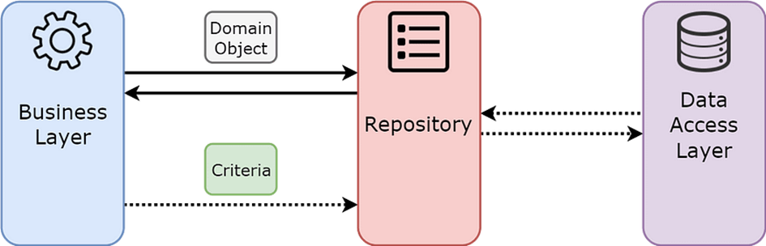

# 🗂️ Repository Design Pattern Nedir?

![Repository Pattern]

**Repository Design Pattern**, veri kaynakları (veritabanı, dosya sistemi, API vb.) ile uygulama arasında bir ara katman sağlar. CRUD (Create, Read, Update, Delete) işlemlerini merkezi ve soyut bir biçimde yönetmek için kullanılır.

---

## 🎯 Amaçları

### ✅ 1. Veri erişimini soyutlamak
İş mantığı (business layer), veritabanının nasıl çalıştığını bilmez. Tek yaptığı repository’de tanımlı metodları kullanmaktır.

### ✅ 2. Katmanlı mimaride düzen
İş katmanı (BLL), doğrudan `DbContext` ya da SQL yazmaz. Repository, bu erişimi izole eder.

### ✅ 3. Kod tekrarını azaltmak
Tüm veri işlemleri tek yerde toplandığı için farklı yerlerde tekrar tekrar yazmaya gerek kalmaz.

### ✅ 4. Unit test kolaylığı
Mock repository kullanılarak testler gerçek veritabanına bağlanmadan çalıştırılabilir.

### ✅ 5. Esnek veri kaynağı geçişi
SQL Server yerine PostgreSQL'e geçildiğinde sadece repository güncellenir.

---

## ✅ Avantajlar

- Veri erişimi merkezi hâle gelir.
- İş ve veri mantığı ayrışır.
- Test edilebilirlik artar.
- Daha sürdürülebilir kod yapısı oluşturulur.

## ❌ Dezavantajlar

- Küçük projelerde aşırı soyutlama karmaşıklık yaratabilir.
- Yanlış kullanıldığında performans düşebilir.

---

## 🔧 Repository Design Pattern – Örnek

### 🧱 Interface
```csharp
public interface IProductRepository
{
    Product GetById(int id);
    IEnumerable<Product> GetAll();
    void Add(Product product);
    void Update(Product product);
    void Delete(int id);
}
```

### 🧱 Concrete Class
```csharp
public class ProductRepository : IProductRepository
{
    private readonly DbContext _dbContext;

    public ProductRepository(DbContext dbContext)
    {
        _dbContext = dbContext;
    }

    public Product GetById(int id) => _dbContext.Products.Find(id);
    public IEnumerable<Product> GetAll() => _dbContext.Products.ToList();
    public void Add(Product product)
    {
        _dbContext.Products.Add(product);
        _dbContext.SaveChanges();
    }
    public void Update(Product product)
    {
        var existing = _dbContext.Products.Find(product.Id);
        if (existing != null)
        {
            _dbContext.Entry(existing).CurrentValues.SetValues(product);
            _dbContext.SaveChanges();
        }
    }
    public void Delete(int id)
    {
        var product = _dbContext.Products.Find(id);
        if (product != null)
        {
            _dbContext.Products.Remove(product);
            _dbContext.SaveChanges();
        }
    }
}
```

### 💼 Kullanım – İş Katmanı
```csharp
public class ProductService
{
    private readonly IProductRepository _productRepository;
    public ProductService(IProductRepository productRepository)
    {
        _productRepository = productRepository;
    }

    public void AddNewProduct(Product newProduct) => _productRepository.Add(newProduct);
    public Product GetProductById(int id) => _productRepository.GetById(id);
    public void UpdateProduct(Product updated) => _productRepository.Update(updated);
    public void RemoveProduct(int id) => _productRepository.Delete(id);
}
```

---

# 📦 Generic Repository Nedir?

**Generic Repository**, her entity için ayrı ayrı CRUD metotları yazmak yerine tek bir generic yapı ile tüm verileri yönetebilmeyi sağlar.

## 🎯 Amaç
- Kod tekrarını azaltmak
- Tüm veri işlemlerini tek sınıfta toplamak
- Yeni bir entity için tekrar repository yazma ihtiyacını ortadan kaldırmak

---

## 🛠️ Generic Repository Yapısı

### 🧾 Interface
```csharp
public interface IGenericRepository<T> where T : class
{
    IEnumerable<T> GetAll();
    T GetById(int id);
    void Add(T entity);
    void Delete(T entity);
    void Update(T entity);
    void Save();
}
```

### 🧱 Concrete Generic Repository
```csharp
public class GenericRepository<T> : IGenericRepository<T> where T : class
{
    private readonly DbContext _context;
    private readonly DbSet<T> _dbSet;

    public GenericRepository(DbContext context)
    {
        _context = context;
        _dbSet = _context.Set<T>();
    }

    public IEnumerable<T> GetAll() => _dbSet.ToList();
    public T GetById(int id) => _dbSet.Find(id);
    public void Add(T entity) => _dbSet.Add(entity);
    public void Delete(T entity) => _dbSet.Remove(entity);
    public void Update(T entity) => _dbSet.Update(entity);
    public void Save() => _context.SaveChanges();
}
```

---

## 💼 Generic Repository Kullanımı

```csharp
IGenericRepository<Product> productRepo = new GenericRepository<Product>(dbContext);
var allProducts = productRepo.GetAll();

IGenericRepository<Customer> customerRepo = new GenericRepository<Customer>(dbContext);
var allCustomers = customerRepo.GetAll();
```

---

## 📊 Neden Generic Repository Kullanılır?

- Kod tekrarını önler.
- Tek bir yapı ile tüm modelleri (Product, Customer, etc.) yönetir.
- Yeni model eklendiğinde sadece parametre değiştirilir, kod yazılmaz.
- Testler için mock repository oluşturmayı kolaylaştırır.

---

## 🧾 Sonuç

| Özellik                         | Repository Pattern | Generic Repository |
|---------------------------------|--------------------|--------------------|
| Soyutlama sağlar               | ✅                 | ✅                 |
| Her modele özel yapı           | ✅                 | ❌ (tek yapı)      |
| Kod tekrarını azaltır          | 🔸 Kısmen          | ✅                 |
| Küçük projelerde tercih edilir | ✅                 | ❌                 |
| Test edilebilirliği artırır    | ✅                 | ✅                 |

---

## 📚 Kaynaklar

- [Microsoft Docs - Repository Pattern](https://learn.microsoft.com/en-us/aspnet/mvc/overview/older-versions-1/models-data/repository-pattern)
- [Entity Framework Core Documentation](https://learn.microsoft.com/en-us/ef/core/)